#  Chaotic Series Forecasting 
```python

Author -> Stefanos Ginargyros

```

## Installation
If you choose to install locally, i recommend installing [mini-conda](https://docs.conda.io/en/latest/miniconda.html) first (a more compact version of conda). Then proceed with these instructions.

```bash

    # clone, dirs, folders etc.
    git clone https://github.com/stefgina/chaotic-series-forecasting.git
    cd chaotic-series-forecasting

    # create the env, and activate
    conda create -n chaotic python=3.10
    conda activate chaotic
    pip install -r requirements.txt
```

## Structure :
`LSTM.py` ,  `GRU.py` , `RNN.py` , `TCNN.py`, `LGBM.py` , `CATBOOST.py`

Different modeling approaches forecasting Chaotic Systems, including both neural networks and tree-based models. These approaches will be presented separately for plots and commands, allowing for a detailed analysis. Additionally, we will compare the numerical results and discuss the models jointly to identify their strengths and weaknesses for the particular dataset alongside their computatational needs. We will also evaluate and discuss the effectiveness of differencing and relative target techniques, as well as other factors affecting performance.

## Numerical Benchmarks :
Numerical Benchmarks based on next step forecastings (t+1). LSTM has the best avg run MSE in combined a) Next state Forecasting, b) Autoregressive forecasting, and it will be the model analyzed in the next section Differencing & Stationarity and the model that we will run experiments on.

| MODEL         | MAE           | RMSE          |SMAPE          | R2            |MSE            |TIME                       |
| ------------- | ------------- | ------------- | ------------- | ------------- | ------------- | -------------             |
| LSTM          | 0.0495    | 0.0620        | 5.7326        | 0.9292        | **0.0038**    | 9.64secs per EPOCH        |
| GRU           | 0.0496        | 0.0621        | 5.7443        | 0.9290        | 0.0039        | 8.91secs per EPOCH        |
| RNN           | 0.0496        | 0.0622        | 5.7479        | 0.9288        | 0.0039        | 2.35secs per EPOCH        |
| TCNN          | 0.0603        | 0.0756        | 7.0103        | 0.8947        | 0.0057        | 18.45secs per EPOCH       |
| LGBM          | 0.0497        | 0.0622        | **5.7040**    | 0.9286        | 0.0039        | **0.06 secs per ESTIMATOR**|
| CATBOOST      | **0.0492**       | **0.0616**    | 5.7116        | **0.9300**    | 0.0038        | 0.5 secs per ESTIMATOR    |

- ## LSTM 
    For network training you can follow this:
    ```
    python  LSTM.py --train --lookback 20 --forecast --batch 512 --dataset test --frozenmodel LSTM_NEW
    ```
    Forecasting next state, from past `lookback` states utilizing a frozen model:
    ```
    python  LSTM.py --forecast --dataset test --batch 512 --frozenmodel LSTM32x32_b512_l20_PROPER --lookback 20
    ```


    <p align="center">
    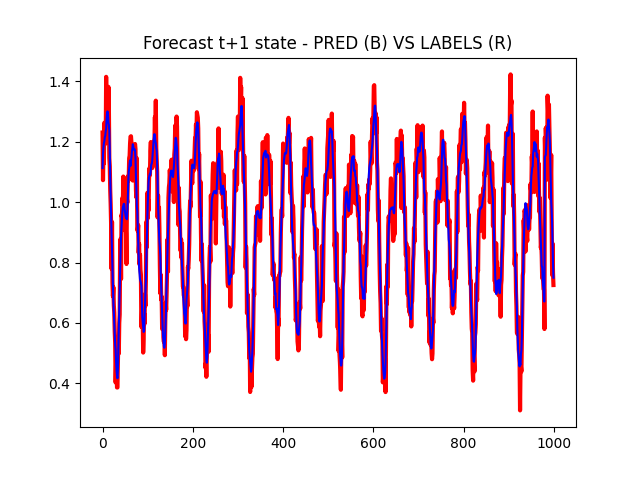
    
    </p>


    Autoregressively forecast next `samples` states, from past `lookback` states:
    ```
    python  LSTM.py --autoregressive --samples 1000 --batch 1 --dataset test --frozenmodel LSTM32x32_b512_l20_PROPER --lookback 20
    ```


    <p align="center">
    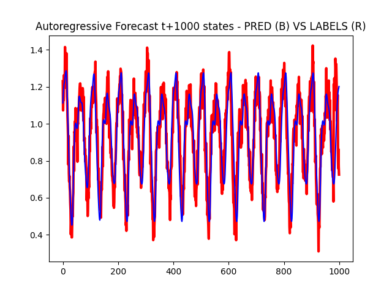
    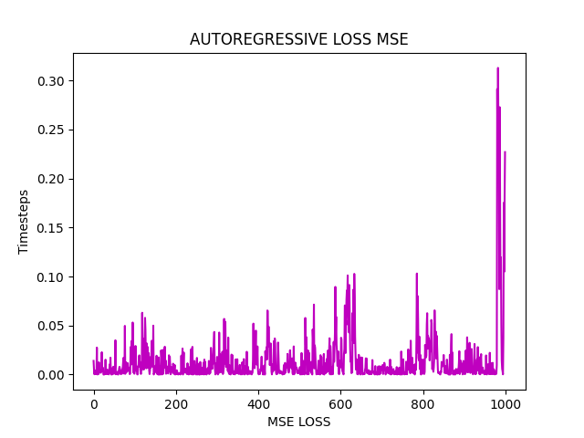
    </p>


- ## GRU 
    For network training you can follow this:
    ```
    python  GRU.py --train --lookback 20 --forecast --batch 512 --dataset test --frozenmodel GRU_NEW --lookback 20
    ```
    Forecasting next state, from past `lookback` states utilizing a frozen model:
    ```
    python  GRU.py --forecast --dataset test --batch 512 --frozenmodel GRU32x32_b512_l20_PROPER --lookback 20
    ```


    <p align="center">
    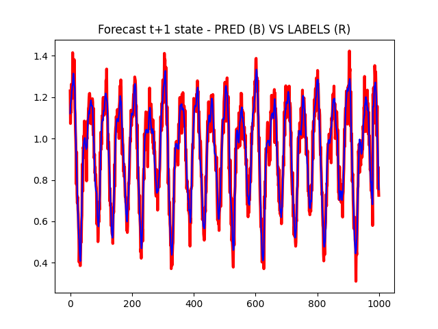
    
    </p>


    Autoregressively forecast next `samples` states, from past `lookback` states:
    ```
    python  GRU.py --autoregressive --samples 1000 --batch 1 --dataset test --frozenmodel GRU32x32_b512_l20_PROPER --lookback 20
    ```


    <p align="center">
    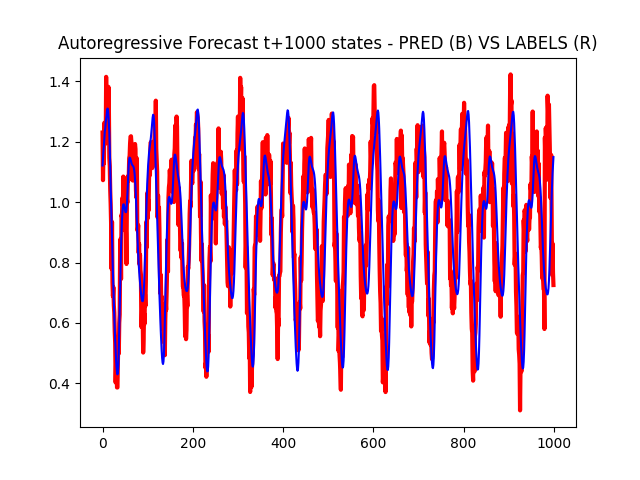
    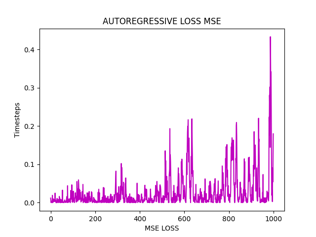
    </p>


- ## RNN 
    For network training you can follow this:
    ```
    python  RNN.py --train --lookback 20 --forecast --batch 512 --dataset test --frozenmodel RNN_NEW 
    ```
    Forecasting next state, from past `lookback` states utilizing a frozen model:
    ```
    python  RNN.py --forecast --dataset test --batch 512 --frozenmodel RNN32x32_b512_l20_PROPER
    ```


    <p align="center">
    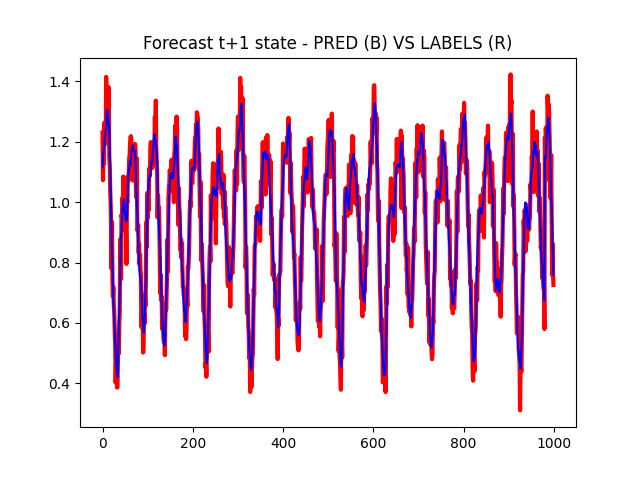
    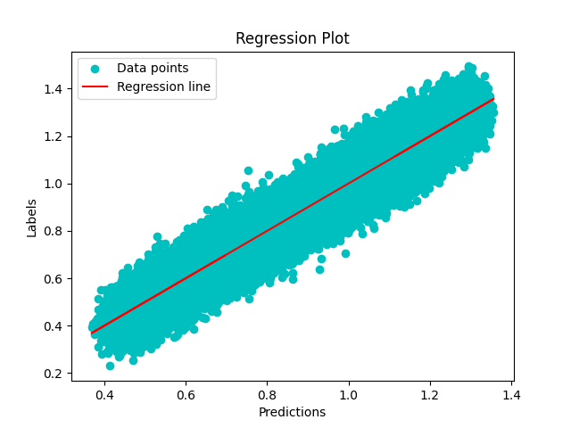
    </p>


    Autoregressively forecast next `samples` states, from past `lookback` states:
    ```
    python  RNN.py --train --lookback 20 --forecast --batch 512 --dataset test --frozenmodel RNN_NEW
    ```


    <p align="center">
    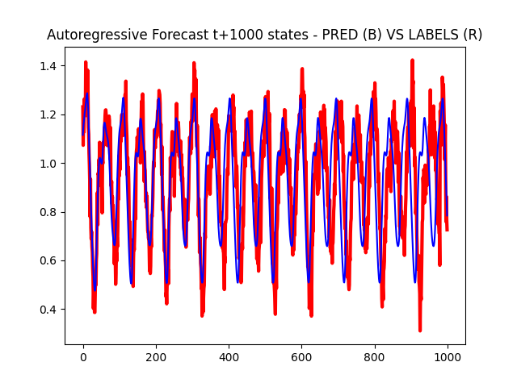
    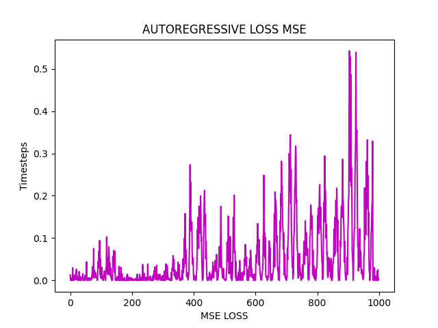
    </p>


- ## LGBM 

    Fast Training and Forecasting next state, from past `lookback` states:
    ```
    python  LGBM.py --train --forecast --dataset test --lookback 20
    ```


    <p align="center">
    
    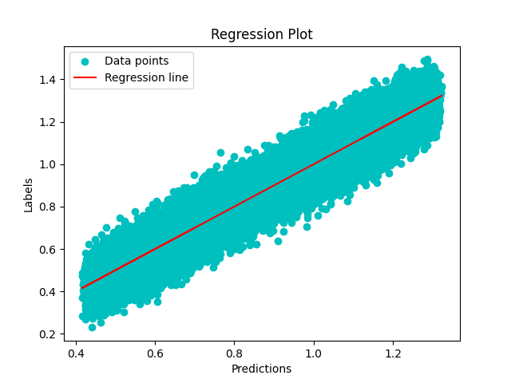
    </p>


    Autoregressively forecast next `samples` states, from past `lookback` states:
    ```
    python  LGBM.py --train --autoregressive --samples 1000 --dataset test --lookback 20
    ```


    <p align="center">
    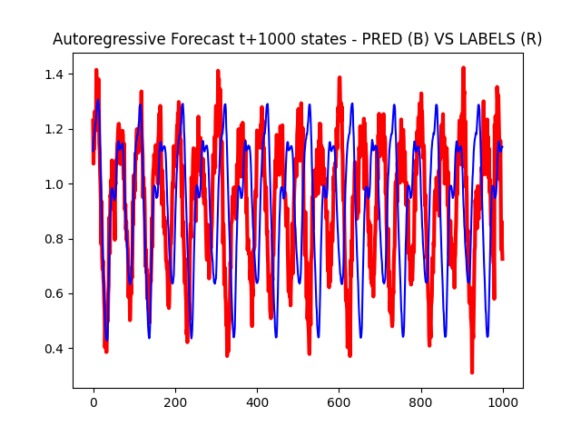
    
    </p>

- ## CATBOOST 

    Fast Training and Forecasting next state, from past `lookback` states:
    ```
    python  CATBOOST.py --train --forecast --dataset test --lookback 20
    ```


    <p align="center">
    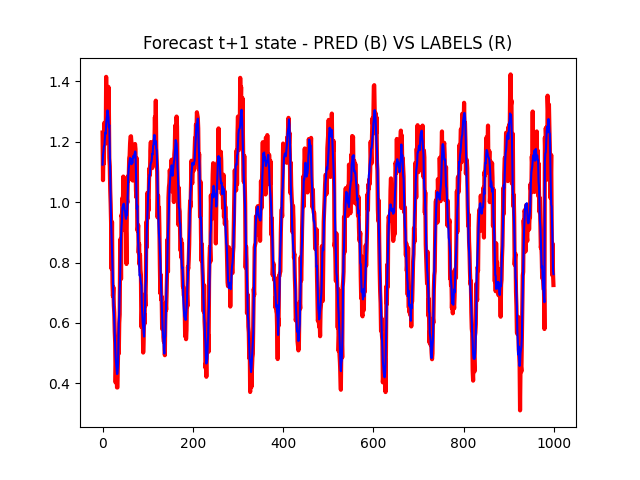
    
    </p>


    Autoregressively forecast next `samples` states, from past `lookback` states:
    ```
    python  CATBOOST.py --train --autoregressive --samples 1000 --dataset test --lookback 20
    ```


    <p align="center">
    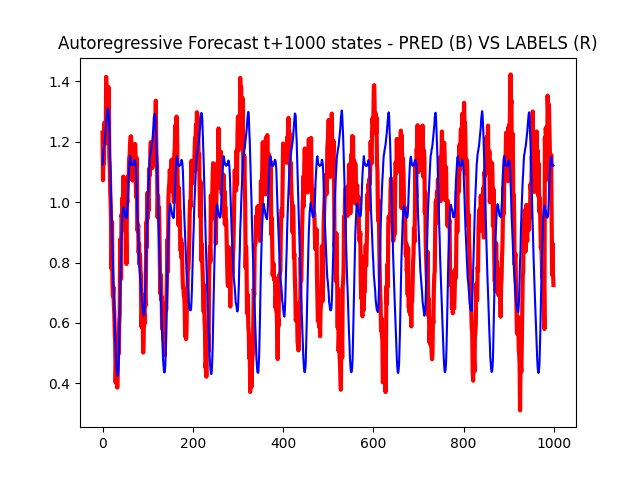
    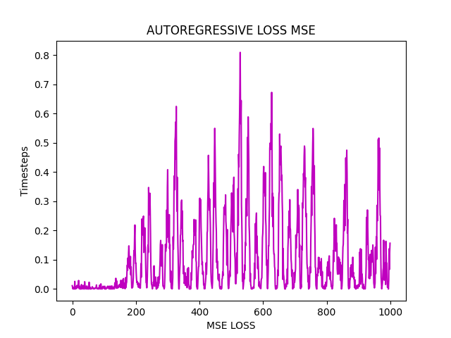
    </p>


## Stationarity & Differencing :

The full given dataset (train, valid) was examined for Stationarity, utilizing the adfuller test. The Augmented Dickey-Fuller (ADF) test is a statistical test used to determine whether a time series is stationary or not. It is based on the assumption that a unit root is present in the autoregressive model of the time series. 

    The particular dataset returned P value less than 0.05 that means we can reject the null hypothesis(Ho). Therefore we can conclude that data has no unit root and is stationary.

Since the data is already stationary, the hypothesis supports that plain differencing could cause overdifferencing on the series distoring the performance. An alternative idea would be to target the relative change of the predicted state on par with the previous state. We benchmark both of these techniques and check if the `overdifferencing` hypothesis holds. The model used for these tests is the best model produced against the numerical benchmarks (LSTM32x32). In order to test properly the Targets will have to transform in the desired encoding, and after the training and prediction inverse transform-back for the following evaluation. 

- Original Targets -- NO ENCODING
    ```
        AE 0.0495 RMSE 0.0620 SMAPE: 5.7326 R2: 0.9292 MSE 0.0038 
    ```
- Differencing on Targets -- TARGET ENCODING: (y2-y1)
    ```
        MAE 0.0495 RMSE 0.0620 SMAPE: 5.7414 R2: 0.9291 MSE 0.0038
    ```
- Relative Change on Targets -- TARGET ENCODING: (y2-y1)/y2
    ```
        MAE 0.0500 RMSE 0.0627 SMAPE: 5.8180 R2: 0.9275 MSE 0.0039 
    ```

`SMAPE` consistently supports our initial assumption enforcing the overdifferencing hypothesis, while `MAE`, `RMSE`, `R2` and `MSE` remain the same or support the hypothesis as well. The Regression plots for the same model, trained seperetaly for each of these techniques: A) ORIGINAL, B) DIFFERENCING, C) RELATIVE


<p align="center">

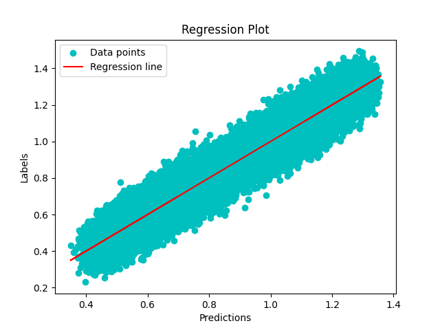
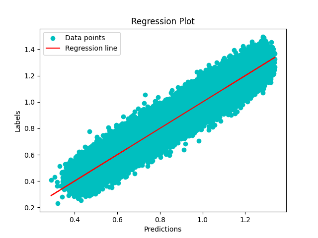
</p>


In order to reproduce these experiments run the following:

```
ORIGINAL: python  LSTM.py --forecast --dataset test --batch 512 --frozenmodel LSTM32x32_b512_l20_PROPER
DIFFERENCING: python  LSTM.py --forecast --difference --dataset test --batch 512 --frozenmodel
RELATIVE: python  LSTM.py --forecast --relative --dataset test --batch 512 --frozenmodel 
```

## Autoregression

Autoregressive Forecasting of `samples` next states, based only on the first `lookback` states. Initially most of my models were performing poorly in this particular task, mostly due to lack of predictive capacity. Autoregression relies on close-to-perfect next state prediction, in order to work properly for a large enough `samples` number, or else it deviates fast.  
Things I tried:     


- Used ARIMA, SARIMA etc (/w Lag Features and without). The results were not satisfactory at all, due to the simplicity of the models. 

- Increased the capacity of my neural networks, from 1 `layer` to 2. As well as their `hidden states` from 8/16 to 32/64. In most of the cases 64 was plain overfit, while 16 couldnt catch the underlying complexity. Decided to keep 32 hidden states, with 2 `layers` across all the architectures to benchmark somehwat fairly/properly.

- Lookback initially was 10, with results bit worse that the current lookback of 20 (1* 10^-4 MSE difference). Gridsearched on values between 5 and 30 with a step of 5. Best results on most Neural Networks achieved with `lookback = 20`, while Tree-Based (LGBM, CATBOOST) perform better on `lookback = 30`.

- Developed a custom `methodology` for neural networks, in order to capture the underlying `future` of each `lookback` sequence even though the output of the NN is 1 dimensional. We essentialy autoregress the next `Horizon` samples , compare the predictions with a preconstructed Horizon augmented Dataset, and update the weights for the next state based on the future states. That way we give more weight to the relationship of the prediction with the future values, and not only with the samples before. Had some interesting results with that on most models, and absolutely need to develop it further. For now I just managed to bump the SMAPE 1*10^-3 against original (still LGBM was better/lot faster), but I think there is potential to that.

    Logic:
    ```python
        # Loop through each Batch, through each Epoch
        for idx in range (args.Horizon):
            if idx == 0:
                pred_i = model(data)
                data_pred = data[:,1:]
                data_pred = torch.cat((data_pred.squeeze(-1), pred_i), dim=1)
            else:
                data_pred = torch.unsqueeze(data_pred, dim=2)
                pred_i = model(data_pred)
                data_pred = data[:,1:]
                data_pred = torch.cat((data_pred.squeeze(-1), pred_i), dim=1)
            outputs.append(pred_i)  # Append the current prediction to the list

        # Concatenate the predictions along the time axis
        outputs = torch.cat(outputs, dim=1).unsqueeze(-1)

        # Compare Autoregressive Predictions with Horizon Pre-Augmented Dataset.
        loss = criterion(outputs, target)
    ```

- Amongst other things sota results can be achieved with `Reservoir Computers` (ESNs, NVARs) and  `GANs` (forGAN). GAns took approx half+ day on M1 Macbook for a system like this.


**As a final statement, LSTM with some tweaks autoregress almost perfectly (~80 R2, 0.01 MSE) all the 980 timesteps on all the 1000 lengthed test trajectories, only based on the first 20 samples. The results here are cumulative for all the 1000 steps. If we examine the same metrics for the first 200 or 300 samples the accuracy is significatnly higher (~89 R2, 0.007 MSE)**

```
980 STEP AHEAD AUTOREGRESSION: MAE 0.0836 RMSE 0.1044 SMAPE: 9.8368 R2: 0.7984 MSE 0.0109 
```

Reproduce this:
```
python  LSTM.py --autoregressive --samples 980 --batch 1 --dataset test --frozenmodel LSTM32x32_b512_l20_PROPER
```

## Computational Complexity
The complexities of the layers imprinted per EPOCH train timings as well:

- Linear FLOPs = B x (N x M + M x N + M)

- Conv FLOPs = B x Number of Output Channels x (K x K x C x H x W + (H_pool x W_pool - 1))

- LSTM FLOPs = B x (N x 4H + 4H x N + H x 4H + 4H x H + H x O + O)

- RNN FLOPs = B x (N x H + H x N + H x H + H x H)

- GRU FLOPs = B x (N x 3H + 3H x N + H x 3H + 3H x H + H x O + O)   

B = Batch size  
N = Input size   
H = Hidden size    
O = Output size     
K = Kernel size  
C = Input channels  
H = Height of input feat map    
W = Width of input feat map  
H = Height of pooled feat map   
W = Width of pooled feat map
